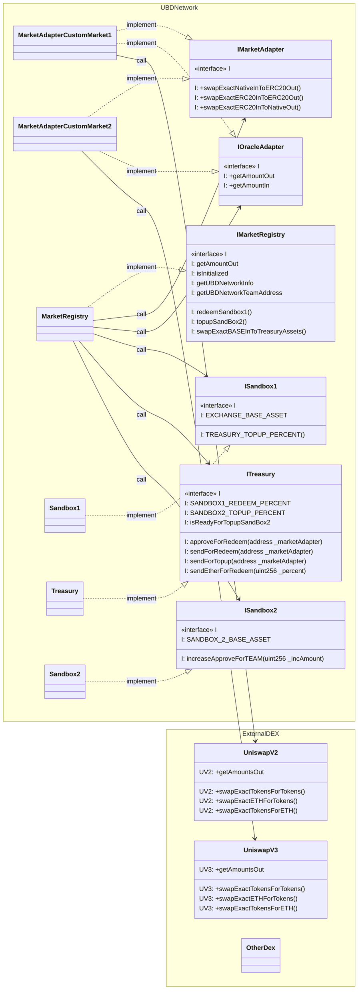

```mermaid
classDiagram

MarketAdapterCustomMarket1 ..|> IMarketAdapter: implement
MarketAdapterCustomMarket1 ..|> IOracleAdapter: implement

MarketAdapterCustomMarket2 ..|> IMarketAdapter: implement
MarketAdapterCustomMarket2 ..|> IOracleAdapter: implement
MarketRegistry ..|> IMarketRegistry: implement

Sandbox1 ..|> ISandbox1: implement
Treasury ..|> ITreasury: implement
Sandbox2 ..|> ISandbox2: implement

MarketAdapterCustomMarket1 --> UniswapV2: call
MarketAdapterCustomMarket2 --> UniswapV3: call

MarketRegistry --> IMarketAdapter: call
MarketRegistry --> IOracleAdapter: call

MarketRegistry --> ISandbox1: call
MarketRegistry --> ITreasury: call
MarketRegistry --> ISandbox2: call
direction LR
namespace UBDNetwork {
class ISandbox1 {
   «interface» I
   I: EXCHANGE_BASE_ASSET
   I: TREASURY_TOPUP_PERCENT()
}

class ITreasury {
   «interface» I 
   I: SANDBOX1_REDEEM_PERCENT
   I: SANDBOX2_TOPUP_PERCENT
   I: isReadyForTopupSandBox2
   I: approveForRedeem(address _marketAdapter)
   I: sendForRedeem(address _marketAdapter)
   I: sendForTopup(address _marketAdapter)
   I: sendEtherForRedeem(uint256 _percent)
}

class ISandbox2 {
   «interface» I
   I: SANDBOX_2_BASE_ASSET
   I: increaseApproveForTEAM(uint256 _incAmount)

}
class IMarketRegistry {
    «interface» I
    I: getAmountOut
    I: isInitialized
    I: getUBDNetworkInfo
    I: getUBDNetworkTeamAddress
    I: redeemSandbox1() 
    I: topupSandBox2()
    I: swapExactBASEInToTreasuryAssets() 
}

class MarketRegistry

    
    class IMarketAdapter{
        «interface» I
        I: +swapExactNativeInToERC20Out()
        I: +swapExactERC20InToERC20Out()
        I: +swapExactERC20InToNativeOut()

    }

    class IOracleAdapter{
        «interface» I
        I: +getAmountOut
        I: +getAmountIn
    }

    class MarketAdapterCustomMarket1
    class MarketAdapterCustomMarket2
    class Sandbox1
    class Treasury
    class Sandbox2
}    


namespace ExternalDEX {

    class UniswapV2{
        UV2: +getAmountsOut
        UV2: +swapExactTokensForTokens()
        UV2: +swapExactETHForTokens()
        UV2: +swapExactTokensForETH()

    }

    class UniswapV3{
        UV3: +getAmountsOut
        UV3: +swapExactTokensForTokens()
        UV3: +swapExactETHForTokens()
        UV3: +swapExactTokensForETH()

    }
    class OtherDex
}
```
